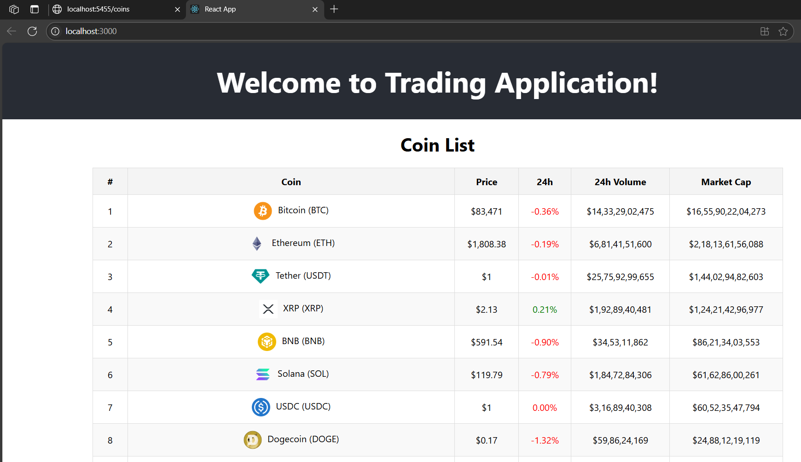

# 💹 Crypto Trading Platform

A full-stack web application to visualize real-time cryptocurrency prices and trends using the [CoinGecko API](https://www.coingecko.com/). Built with **Spring Boot** and **React.js**, this platform allows users to track top coins, explore 7-day historical price charts, and analyze performance in a responsive UI.

---

## 🚀 Features

- ✅ Real-time crypto data: price, market cap, and 24h change
- 📊 7-day historical charts for any cryptocurrency
- ⚛️ Modern frontend built with React.js
- 🌐 RESTful backend powered by Spring Boot & Hibernate
- 🔐 Secure CORS configuration using Spring Security 6
- 💾 MySQL integration with auto-persistence via JPA
- ⚙️ Optimized data fetching and state management with React Hooks

---

## 🛠 Tech Stack

**Frontend:**
- React.js
- Chart.js / Recharts
- Vite or Create React App
- Fetch API

**Backend:**
- Spring Boot 3.3.1
- Spring Security 6
- Hibernate + JPA
- MySQL
- CoinGecko API

---

## 📁 Folder Structure

```
trading/
├── src/
│ ├── main/
│ │ ├── java/com/chaitu/trading/ # Backend logic
│ │ └── webapp/frontend/ # React frontend
├── pom.xml # Maven backend project
└── application.properties # DB & API configuration
```
---


## 📦 Getting Started

### 🔧 Prerequisites

- Java 17 or later
- Node.js 18+ and npm
- MySQL Server running locally
- Git (for version control)
- CoinGecko Pro API Key (free)

---

## 🧑‍💻 Backend Setup (Spring Boot)

1. **Create a MySQL database:**

```sql
CREATE DATABASE trading;
```

2. **Configure the Application**
File: src/main/resources/application.properties

properties
```
spring.datasource.url=jdbc:mysql://localhost:3306/trading
spring.datasource.username=your_mysql_username
spring.datasource.password=your_mysql_password

spring.jpa.hibernate.ddl-auto=update

server.port=5454

coingecko.api.key=YOUR_CG_API_KEY
```

3. **Run the Backend**

If successful, the backend will be running at:
👉 http://localhost:5454

---

## 🌐 Frontend Setup (React)
1. **Navigate to the React Project**

```
cd src/main/webapp/frontend
```
 
2. **Install Dependencies**

```bash
npm install
```

3. **Start the Development Server**

```bash
npm run dev
```

Frontend will be available at:
👉 http://localhost:3000

---

## 🔁 API Endpoints
Method	Endpoint	Description
GET	/coins	Get list of all coins from DB
GET	/coins/{id}	Get coin details by ID

---

## 🧪 Example Usage
Open http://localhost:3000
View top 100 crypto coins with name, price, and 24h change

---

## 📸 Screenshots
Output images here after frontend is loaded successfully.

### 📍 Coin Chart
